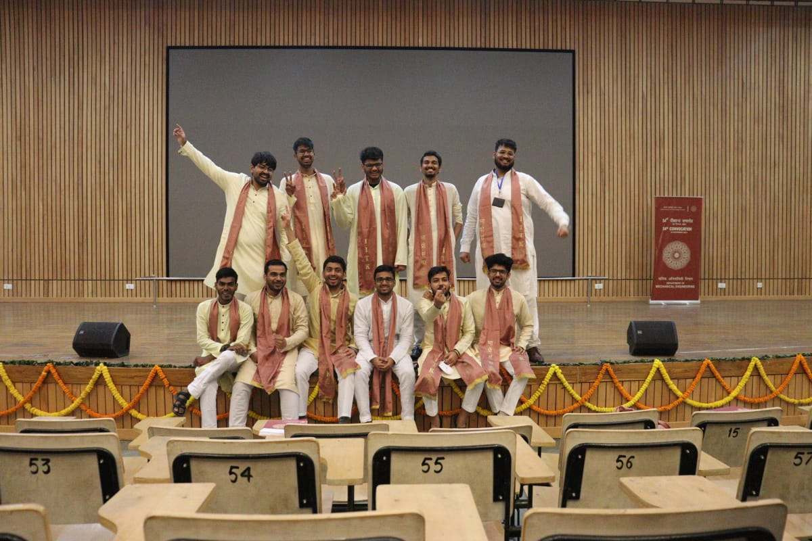

[IIT Kanpur Convocation](https://www.iitk.ac.in/doaa/convocation/) The Convocation will be held in a hybrid mode. 
The students can attend the ceremony either in person or virtually on the online platform to be made available 
for this purpose. Students who attend the ceremony virtually will receive their degrees through speed post.

| Picture with Batchmates |

## Features

- Responsive design
- Mathematics with Latex notation
- Comment threads
- Pagination
- Browsing by categories/tags
- Archive: posts timeline
- Homepage slider of feature posts
- Blog widgets
- Back to top button
- Vintage fashion

## Quick-start guide

1. Assume you already installed Jekyll following [instructions](https://jekyllrb.com/docs/quickstart/).
2. Fork and clone [tranquil-theme](https://github.com/swang2015/tranquil-theme.git).
3. Edit site options in `_config.yml`, create your own posts in `_post/`.
4. Run `jekyll serve` under site directory and your site is on now!

## Some notes

- edit your social accounts in `_data/social.yaml`
- assign ONE category for each post
- add `feature` into tags if you want to show post at homepage slider
- go to `images/` and place sidebar portrait pic and ads pic
- if [MathJax](https://www.mathjax.org/) is enabled, use `\[...\]` for displayed mathematics and `\(...\)` for in-line mathematics
- ADVANCED: if you want to further customize your site, check out [Jekyll](https://jekyllrb.com/docs/home/) to understand how it works, also check out [html/css/javascript tutorials](http://www.w3schools.com/) and [liquid language](http://shopify.github.io/liquid/) to learn code.

### site configurations

| Variable | Description |
| --- | --- |
| baseurl | the subpath of the site |
| paginate | posts per pagination |
| disqus_forumname | create a site on disqus and put the forum name here |
| aboutme | a description about self |
| ads | ads banner image path |

### post configurations

| Variable | Description |
| --- | --- |
| background | post's feature picture |
| category | put ONE category in each post |
| tags | a list of tags |
| math | set `true` or `false` to enable MathJax mathematics |
